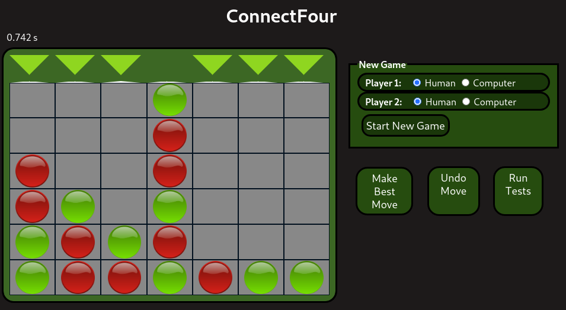

# Vier Gewinnt (PiS, SoSe 2020) 

Autor: Benjamin Schichtholz

Ich habe die Zulassung für PiS im SoSe 2020 bei Herrn Herzberg erhalten.

## Einleitung

Dies ist die Dokumentation zur Implementierung des Spiels "Vier Gewinnt". Die Spiellogik wurde mit der Programmiersprache <b>Kotlin</b> realisiert, die Oberfläche wurde mit <b>HTML, CSS</b> und <b>JavaScript</b> gestaltet und kann im Browser aufgerufen werden. Das Spiel beinhaltet eine Spielengine, welche mithilfe des Alpha-Beta-Algorithmus den bestmöglichen Zug ermittelt. Dieses Projekt ist die Prüfungsleistung für das Modul "Programmierung interaktive Systeme" im Studiengang Informatik an der Technischen Hochschule Mittelhessen.

### Spielregeln

Das Spielbrett hat 8 Reihen und 6 Spalten. Es gibt zwei Spieler, welche Spielsteine ihrer jeweiligen Farbe in eine bestimmte Spalte setzen dürfen. Dieser gesetzte Spielstein kommt in das von unten gesehen erste freie Feld. Die Spielsteine können also aufeinander gelegt werden. Schafft es ein Spieler, vier Spielsteine so anzuordnen dass sie vertikal, horizontal oder vertikal eine Reihe ergeben, hat dieser Spieler gewonnen.

### Bedienungsanleitung
#### Screenshot

#### Oberfläche
Auf der <b>linken Seite</b> der Benutzeroberfläche ist das Spielbrett zu sehen. Bei den jeweiligen Spalten in die man Spielsteine setzen kann, kann man durch den Klick auf eines der Dreiecke sein Spielstein in eine Spalte setzen. Oben links über dem Spielbrett befindet sich eine Zeitanzeige, welche die Dauer zum Ermitteln des besten Zuges vom letzten computergenerierten Zug anzeigt.
Auf der <b>rechten Seite</b> hat der Benutzer weitere Auswahlmöglichkeiten. Im oberen Abschnitt (New Game) kann ein neues Spiel gestartet werden. Dabei kann ausgewählt werden, welcher Spieler ein menschlicher Spieler oder ein computergesteuerter Spieler ist. Hierbei ist Player1 immer der beginnende Spieler. Darunter befinden sich drei weitere Knöpfe. Mit "Make Best Move" kann der sich menschliche Spieler für den nächsten Zug vom Computer den bestmöglichen Zug spielen lassen. Mit "Undo Move" wird der zuletzt ausgeführte Spielzug rückgängig gemacht. Spielt der Mensch gegen den Computer und der letzte Zug des Computers wird rückgängig gemacht, passiert folgendes: Der Mensch darf zuerst den Zug des Computers machen und danach seinen eigenen Zug. Danach geht das Spiel wie gewohnt weiter und der Computer antwortet automatisch auf den Zug seines Gegenspielers. Der Knopf "Run Tests" startet 5 Testfälle, welche auf der Konsole ausgegeben werden.

#### Spielmodi
Die Auswahlmöglichkeiten im Feld "New Game" auf der rechten Seite lassen folgende Spielkonstellationen zu:
* Mensch gegen Computer (Standardeinstellung, Mensch beginnt)
* Computer gegen Mensch (Computer beginnt)
* Mensch gegen Mensch (Spieler 1 beginnt)
* Computer gegen Computer (Spieler 1 beginnt)

### Engine
In diesem Abschnitt werden Details zur Engine erläutert. Der Fokus dabei liegt auf der Klasse <b>Board</b>.
#### Basis-Implementierung des Spiels
* ##### Interface Game
Das Interface Game wird von der Klasse Board implementiert. Dieses Interface beschreibt die wichtigsten Funktionen, welche ein Spiel mit einer Implementierung für die Berechnung des bestmöglichen Zuges haben sollte. Außerdem zeigt sich bereits im Interface, das eine Implementierung des Interface immutabel sein muss. So geben die Methoden, welche das Spielbrett verändern (z.B. makeMove(),undoMove()) ein neues Game mit den geänderten Werten zurück. Außerdem sind hier bereits Funktionen vorhanden, welche mit dem Alpha-Beta-Algorithmus zusammenspielen: bestMove(), makeBestMove(), symmetricBoard(), possibleMoves().

* ##### Klasse Board
Die Klasse Board enthält die gesamte Spiellogik. Hier werden alle wichtigen Informationen zum aktuellen Spielbrett gespeichert.
Das Spielbrett wird in zwei sogenannten Bitboards abgespeichert. Das heißt, dass die Information über die Position der Spielsteine in zwei Long-Werten abgespeichert sind und dass einzelne Bits dieser Werte Positionen auf dem Spielbrett widerspiegeln. Die folgende Abbildung zeigt, welche Bits beim Spiel Vier Gewinnt an welcher Position stehen. Dabei ist das 0te Bit das sogenannte least significant Bit, also das erste Bit von rechts aus gesehen.

          6 13 20 27 34 41 48   55 62     Zusätzliche Zeile
        +---------------------+
        | 5 12 19 26 33 40 47 | 54 61     Oberste Zeile
        | 4 11 18 25 32 39 46 | 53 60
        | 3 10 17 24 31 38 45 | 52 59
        | 2  9 16 23 30 37 44 | 51 58
        | 1  8 15 22 29 36 43 | 50 57
        | 0  7 14 21 28 35 42 | 49 56 63  Unterste Zeile
        +---------------------+
        (Abbildung Bitboard)

Die grundlegende Idee zur Implementierung von Bitboards, die Klassenvariablen und die dazugehörigen Methoden (makeMove(),undoMove(),possibleMoves(),isWinning(player)) für das Spiel Vier Gewinnt stammt aus dem Artikel <b>Bitboards and Connect Four</b>, welches von Dominikus Herzberg auf GitHub veröffentlicht wurde (https://github.com/denkspuren/BitboardC4/blob/master/BitboardDesign.md).

Die beiden Bitboards sind in Klassenvariablen und werden gemeinsam in einem Array <b>bitboard</b> abgespeichert, sodass mit bitboard[0] bzw bitboard[1] darauf zugegriffen werden kann.

Die Klassenvariable <b>counter</b> wird bei jedem gemachten Zug (makeMove()) um 1 erhöht bzw. bei der Methode undoMove() um 1 erniedrigt. Anhand von counter kann man leicht ermitteln, welcher Spieler momentan am Zug ist. Verbindet man counter mit der logischen Verknüpfung und 1 (counter and 1), gibt es für eine gerade counter-Zahl 0 zurück (Spieler 1) und für jede ungerade Zahl 1 (Spieler 2).

Die Klassenvariable <b>height</b> speichert die aktuelle Höhe für die jeweilige Spalte in einem Array ab. Am Anfang entspricht die Höhe der jeweiligen Spalten [0, 7, 14, 21, 28, 35, 42] (siehe Abbildung Bitboard).

Die Klassenvariable <b>moves</b> ist eine Liste aus Integer-Werten, welche die bereits gespielten Züge abspeichert. Entfernt man den letzten zugehörigen Spielstein aus der angegebenen Spalte, kann der zuletzt getätigte Zug rückgängig gemacht werden.

Die Methoden makeMove(), undoMove() wurden aus dem oben genannten Artikel übernommen und so angepasst, dass sie nicht das aktuelle Spielfeld verändern, sondern ein neues Spielfeld zurückgeben. Die anderen beiden Methoden (isWinning(player), possibleMoves()) wurden hauptsächlich übernommen und in Kotlin-Code übersetzt.

(Aufbau, Klassenvariablen)
Grundlegende Methoden erläutern (makeMove, isGameOver, undoMove, possiblMoves)
→ toString (evtl. Hinweis auf Zeichen für Spielsteine & wo sie geändert werden können)
Quelle angeben (Herzberg GitHub)
#### Monte-Carlo
→ Einzelne Methoden beschreiben (playRandomGame(),simulateGames(),evaluateMoves())
→ Bewertungslogik beschreiben (warum wurde der Durchschnitt genommen)
Quelle angeben (Herzberg TicTacToe)
#### Alpha-Beta
→ Grundsätzliches (Algorithmus läuft immer aus Sicht von Spieler 1)
→ bestMove()-Aufruf mit invBoard()
→ Parameter (depth, maximize, alpha, beta, cache)
→ Rückgabewert Pair<Int?,Int>
→ getBitPair beschreiben (Wozu ist die Funktion da?)
→ Algorithmus beschreiben (shuffled(), Blick auf das nächste Board)
→ Zusammenspiel mit MonteCarlo (Wann wird bewertet?)
→ HashMap

### Testfälle

### Technische Umsetzung der Oberfläche

### Dateiübersicht

    \build.gradle
    \README.md
    \bin\main\public\index.html
    \bin\main\TicTacToe\App.kt
    \bin\main\TicTacToe\T3.kt
    \src\main\kotlin\TicTacToe\App.kt
    \src\main\kotlin\TicTacToe\T3.kt
    \src\main\resources\public\index.html

    -------------------------------------------------------------------------------
    Language                     files          blank        comment           code
    -------------------------------------------------------------------------------
    Markdown                         1             71              0            270
    Kotlin                           3             27              3            113
    HTML                             1             11             17             80
    XML                              2              0              0             41
    Gradle                           1              8             12             16
    INI                              1              0              0             13
    -------------------------------------------------------------------------------
    SUM:                             9            117             32            533
    -------------------------------------------------------------------------------
